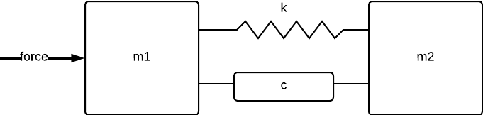

# Disturbance modeling in ModelingToolkit
In this tutorial, we will add a model of a disturbance to a model of a closed-loop control system. Modeling disturbances is an integral part of control design and analysis, and sometimes also used in order to make the designed controller capable of rejecting the disturbance (using the internal-model principle).

This example will roughly follow that of [Disturbance modeling and rejection with MPC controllers](@ref), but will use the disturbance-modeling capabilities of ModelingToolkit rather than manually adding states to a linear model.

We set out by **defining the model** for the controlled system. We will use a system where two inertias (rotating masses) are connected by a damped flexible shaft.


This model is common in any system where a motor is driving a load, such as in robotics or in the automotive industry.

```@example MTK_DISTURBANCE
using DyadControlSystems
using ModelingToolkit, OrdinaryDiffEq, Plots, LinearAlgebra
using ModelingToolkitStandardLibrary.Mechanical.Rotational
using ModelingToolkitStandardLibrary.Blocks
using ModelingToolkit: connect
using ControlSystemsMTK
t = ModelingToolkit.t_nounits
gr(fmt=:png) # hide

indexof(sym,syms) = findfirst(isequal(sym),syms)

## Build the system model ======================================================
# Parameters
m1 = 1
m2 = 1
k = 10 # Spring stiffness
c = 3  # Damping coefficient

@named inertia1 = Inertia(; J = m1, phi=0, w=0)
@named inertia2 = Inertia(; J = m2, phi=0, w=0)
@named spring = Spring(; c = k)
@named damper = Damper(; d = c)
@named torque = Torque(use_support=false)

function SystemModel(u=nothing; name=:model)
    eqs = [
        connect(torque.flange, inertia1.flange_a)
        connect(inertia1.flange_b, spring.flange_a, damper.flange_a)
        connect(inertia2.flange_a, spring.flange_b, damper.flange_b)
    ]
    if u !== nothing
        push!(eqs, connect(torque.tau, u.output))
        return @named model = ODESystem(eqs, t; systems = [torque, inertia1, inertia2, spring, damper, u])
    end
    ODESystem(eqs, t; systems = [torque, inertia1, inertia2, spring, damper], name)
end


model = SystemModel() # Model with load disturbance
cmodel = complete(model)
```

The model does at this stage have a large number of equations and states, but we know that a minimal realization of the system has a statespace realization consisting of the positions and velocities of the two inertias. 

## Design an LQR controller
Next, we design a naive LQR controller for the system, assuming for now that we can measure all states. MTK does not guarantee which states are selected when the model is simplified, so we thus formulate the LQR cost function in terms of a manually chosen state realization. We specify this in the array `model_outputs`. To assemble the state-cost matrix for the LQR problem we make use of the helper function `build_quadratic_cost_matrix` (remember, we do not know the order of the states).

We also add a step disturbance ``d`` to the input of the system and form the closed-loop system. 
```@example MTK_DISTURBANCE
@named d = Step(start_time=1, duration=10) # Disturbance
cmodel_outputs = [cmodel.inertia1.w, cmodel.inertia2.w, cmodel.inertia1.phi, cmodel.inertia2.phi] # This is the state realization we want to control
model_outputs = [model.inertia1.w, model.inertia2.w, model.inertia1.phi, model.inertia2.phi] # This is the state realization we want to control
inputs = [cmodel.torque.tau.u]
op = Dict(inputs .=> 0.0)
matrices, ssys = ModelingToolkit.linearize(cmodel, inputs, cmodel_outputs; op)
linsys = ss(matrices...)
C = linsys.C

# Design state-feedback gain using LQR
# Define cost matrices
x_costs = [
    cmodel.inertia1.w =>   1
    cmodel.inertia2.w =>   1
    cmodel.inertia1.phi => 1
    cmodel.inertia2.phi => 1
]
Q = build_quadratic_cost_matrix(matrices, ssys, x_costs)
@assert size(Q) == (4, 4)
L = lqr(linsys, 100Q, I(1))*C # Post-multiply by `C` to get the correct input to the controller
@named state_feedback = MatrixGain(K=-L) # Build negative feedback into the feedback matrix
@named add = Add() # To add the control signal and the disturbance

connections = [
    [state_feedback.input.u[i] ~ model_outputs[i] for i in 1:4]
    connect(d.output, :d, add.input1)
    connect(add.input2, state_feedback.output)
    connect(add.output, :u, model.torque.tau)
]
closed_loop = ODESystem(connections, t, systems=[model, state_feedback, add, d], name=:closed_loop)


prob = ODEProblem(structural_simplify(closed_loop), Pair[], (0., 20.))
sol = solve(prob, Rodas5(), dtmax=0.1); # set dtmax to prevent the solver from overstepping the entire disturbance
plot(plot(sol, idxs=[model.inertia1.phi, model.inertia2.phi]), plot(sol, idxs=[state_feedback.output.u], title="Control signal"))
```
When we simulate this system, we notice a very **large stationary error** during the time when the disturbance is active. Ideally, the controller should have rejected this disturbance, but failed to do so completely. We can ask for the transfer function from the input of the plant to one of the outputs, say, the position of the load (the second inertia):
```@example MTK_DISTURBANCE
S = ss(get_sensitivity(closed_loop, :u)[1]...)
P = ss(linearize(model, [cmodel.torque.tau.u], [cmodel.inertia2.phi]; op)[1]...)
dc = dcgain(P*S, 1e-6)[]
bodeplot(P*S, lab="\$P(s)S(s)\$")
hline!([dc], label="DC gain = $(round(dc, sigdigits=3))", l=(:black, :dash))
```
This transfer function has a rather large DC-gain of 
```@example MTK_DISTURBANCE
dcgain(P*S, 1e-6)[]
```
which is also what we see as the remaining stationary error cause by the disturbance.

To get rid of the stationary error, we need to make sure that the controller has **integral action**. When the controller is based on state-feeback, it may not be obvious how to do so.

There are generally two different approaches to this:
1. Integrate the control error explicitly and add this as a state in the system.
2. Model a constant disturbance acting on the input and estimate the disturbance using an observer (state estimator)

See the page [Integral action](@ref) for additional details on these approaches.

In this tutorial, we will take the second approach, and add an integrating disturbance model to the system. The transfer function for an integrator is ``1/s``, which also happens to be the transfer function for a unit step function. This should serve as an indication that the addition of such a disturbance model will be suitable to cancel out the step disturbance we simulated the system with.

## Add disturbance model
In ModelingToolkit, we may associate disturbance models with our system model by creating a `ModelingToolkit.DisturbanceModel`. This object takes the input signal in the system where the disturbance enters, in this case at the plant input, as well as a model of the disturbance. We use the transfer function ``1 / (s + \epsilon)`` in order to improve numerical robustness of the Riccati solver (the disturbance state is not controllable). We then call `ModelingToolkit.add_input_disturbance` to add the disturbance model to the system model. The result of this is a couple of generated dynamics functions as well as an `ODESystem` augmented with the states of the disturbance model. For continued control design, we also linearize the augmented system.
```@example MTK_DISTURBANCE
s = tf("s")
integrator = 1/(s + 1e-3) # An (almost) integrating disturbance model. The 1e-3 is for numerical robustness in the Riccati-equation solver.
@named dist = ModelingToolkit.DisturbanceModel(cmodel.torque.tau.u, integrator)
(f_oop, f_ip), augsys, dvs, p = ModelingToolkit.add_input_disturbance(model, dist)

@unpack u, d = augsys
matrices, ssys = linearize(augsys, [u, d], cmodel_outputs; op)
lsys = named_ss(augsys, [u, d], cmodel_outputs; op)
```

## Design output-feedback controller using LQG
We now proceed to design an LQG controller for the augmented system. We thus no longer assume that we have perfect knowledge of all the system states, and have to use an observer (state estimator). The observer (Kalman filter) will also be responsible of estimating the state of the disturbance, ``d``. This will allow the controller to cancel out the disturbance, achieving integral action due to the integrating model for ``d``.

When designing the Kalman filter, we need to provide covariance matrices ``R_1, R_2``. For the ``R_1`` matrix, we once again make use of [`build_quadratic_cost_matrix`](@ref) since we do not know the order of the states. When designing the cost matrix ``Q_1``, we place no cost on the disturbance state, this is not controllable anyway (it should be obvious why the controller cannot affect the disturbance).

We assemble the closed-loop system and simulate it. We also derive the sensitivity function at the plant input (the input sensitivity is SISO as opposed to the sensitivity at the plant output) in order to get a feeling for the closed-loop robustness.
```@example MTK_DISTURBANCE
augsys = complete(augsys)
# Define cost and covariance matrices
x_costs = [
    augsys.inertia1.w =>   1
    augsys.inertia2.w =>   1
    augsys.inertia1.phi => 10
    augsys.inertia2.phi => 10
    augsys.dist.x[1] => 0 # We do not penalize the disturbance state, it is not controllable
]

x_variances = [
    augsys.inertia1.w =>   10
    augsys.inertia2.w =>   10
    augsys.inertia1.phi => 1
    augsys.inertia2.phi => 1
    augsys.dist.x[1] => 100         # This corresponds to the integral gain of the controller
]

Q1 = build_quadratic_cost_matrix(matrices, ssys, x_costs)
Q2 = 1.0 * I(1)
R1 = build_quadratic_cost_matrix(matrices, ssys, x_variances)
R2 = Diagonal([1,1,1,1]) # Order is the same as in model_outputs
lqg = LQGProblem(lsys[:, :u].sys, Q1, Q2, R1, R2)
G_cont = -observer_controller(lqg) # Build negative feedback into the controller
@named cont = ODESystem(G_cont)

@named add = Add() # To add the control signal and the disturbance
@named dstep = Step(start_time=1, duration=10) # Disturbance

model_outputs = [model.inertia1.w, model.inertia2.w, model.inertia1.phi, model.inertia2.phi]

connections = [
    [cont.input.u[i] ~ model_outputs[i] for i in 1:4]
    connect(cont.output, add.input2)
    connect(add.input1, dstep.output)
    connect(add.output, :u, model.torque.tau)
]
closed_loop = ODESystem(connections, t, systems=[model, cont, add, dstep], name=:closed_loop)

prob = ODEProblem(structural_simplify(closed_loop), Pair[], (0., 20.))
sol = solve(prob, Rodas5(), dtmax=0.1); # set dtmax to prevent the solver from overstepping the entire disturbance

f1 = plot(sol, idxs=[model.inertia1.phi, model.inertia2.phi])
f2 = plot(sol, idxs=[cont.output.u, cont.x[1]], lab=["Control signal" "Estimated disturbance"])


S = ss(get_sensitivity(closed_loop, :u)[1]...) |> minreal
w = exp10.(LinRange(-1.5, 2, 200))
f3 = bodeplot(S, w, plotphase=false, legend=:bottomright, title="Sensitivity")
Ms, ws = hinfnorm2(S)
scatter!([ws], [Ms], label="Ms = $(Ms)", markershape=:circle, markersize=3, markercolor=:red)
plot(f1,f2,f3, layout= @layout([[a;b] c]), size=(800, 600))
```
We now see that the controller effectively cancels the disturbance and the inertias rapidly return to the origin after the onset of the disturbance. The peak in the sensitivity function appears to be around 1.45, corresponding to a minimum phase margin of ``2 \sin^{-1}(1/(2M_S)) ≈ 40°`` and a minimum gain margin of ``M_S/(M_S-1) ≈ 3.2``, not great, not terrible.


## Automatic robustification

Tuning an LQG controller is rather tedious and not always intuitively easy, in this case, it's like tuning one PID controller and one PD controller at the same time (we have two positional state variables, two velocity state variables and one integrator state). We did get a reasonably robust design above, but can we improve upon this?

In this section, we will attempt automatic robustification of the design using the method of Glover and McFarlane, sometimes referred to as *normalized co-prime factor synthesis* or *robust loop shaping*. When employing this method, we provide an initial controller (here called the *loop-shaping weight* `W1`). For this, we will use the controller we designed above. The function [`glover_mcfarlane`](@ref) then outputs a "robustified" controller ``K``, that we will evaluate alongside the original controller in a Nyquist plot
```@example MTK_DISTURBANCE
G = system_mapping(lqg)
W1 = -G_cont
K, γ, info = glover_mcfarlane(G, 1.05; W1)
labels = ["LQG" "GMF"]
# gangoffourplot(G, [-G_cont, K], w)
nyquistplot([-G_cont, K] .* Ref(G), w; ylims=(-2,2), xlims=(-5, 0.2), Ms_circles=[Ms], labels)
```
We see that the Glover-McFarlane controller (GMF) appears to be further from the critical point than the LQG controller, indicated by the dashed circle of radius ``1/M_S``. If we calculate the guaranteed margins for this controller, we get
```@example MTK_DISTURBANCE
let S = input_sensitivity(G, K)
    Ms, _ = hinfnorm2(S)
    (; phase_margin = 2asin(1/(2Ms)) |> rad2deg,
    gain_margin = Ms/(Ms-1))
end
```
Slightly better!

## Controller reduction
When we employ any $\mathcal{H}_∞$-based method, such as that of Glover and McFarlane, we may end up with a high-order controller
```@example MTK_DISTURBANCE
K.nx
```
Typically, we can reduce the order slightly of such a controller without affecting its performance. Below, we make use of [`controller_reduction`](@ref) to reduce the controller to order 5. After having done this, we look at the Nyquist plots once more to check that we didn't screw anything up.
```@example MTK_DISTURBANCE
Kgmfr, hs = controller_reduction(lqg.sys, -K, 5) # Expects positive-feedback controller
Kgmfr = -Kgmfr  # Flip sign again
Kgmfr.D .*= 0.0 # a hack to get better rolloff after reduction
nyquistplot([-G_cont*G, K*G, Kgmfr*G], w, ylims=(-2,2), xlims=(-5, 0.2), Ms_circles=[Ms], lab=["LQG" "GMF original" "GMF Reduced"])
```
In this case, it looks like the reduced-order controller achieves a better margin still!

We also check the loop-transfer functions to see how the Glover-McFarlane method changed the loop shape
```@example MTK_DISTURBANCE
w = exp10.(LinRange(-3, 2, 300))
marginplot([-G_cont*G, K*G, Kgmfr*G], w, lab=["LQG" "GMF original" "GMF Reduced" "" "" ""], plotphase=true, size=(1000,900))
```
The changes are rather subtile in this example, but nevertheless improved the phase margin at the input by 10°.

## Do the same thing with only linear tools
By now, the tutorial so far has gone through the following steps
- Model the system
- Design an LQR controller
- Being unhappy with the lack of integral action
- Model an integrating disturbance and add this to the system model
- Design an LQG controller

The avid reader might have noticed that the closed-loop system we have designed above is completely linear, the plant model is linear and the controller is linear. We may thus arrive at the same results using much simpler techniques, and may ask ourselves why we went through the complicated disturbance modeling in the first place. The reasons are twofold
- We could have made use of a nonlinear disturbance model.
- We could have made use of a nonlinear observer.

Indeed, adding disturbance models to nonlinear observers is very useful, this allows us to, e.g., add integral action to a nonlinear MPC controller. We will illustrate how we can create a standalone observer for the disturbance below, but first show how to add disturbance models to a linear model using simpler techniques. We simply linearize the plant and call [`add_low_frequency_disturbance`](@ref), after which we have a model equivalent to the linearized augmented system above.
```@example MTK_DISTURBANCE
matrices2, ssys2 = linearize(model, [cmodel.torque.tau.u], cmodel_outputs; op);
lsys2 = add_low_frequency_disturbance(ss(matrices2...), ϵ=1e-3)
```
compare this to the linearized augmented system from above
```@example MTK_DISTURBANCE
lsys[:, :u].sys
```
They are equivalent, but the disturbance state may appear in a different order.

## Construct Kalman filter for state estimation
Lastly, we show how to create an explicit observer operating in discrete-time. We extract the output trajectory ``y`` from the simulation `sol` we made above, and add some measurement noise to simulate a more realistic scenario. We then create a [`KalmanFilter`](@ref) and call [`forward_trajectory`](@ref) to perform state estimation along the entire trajectory at once. Lastly, we go through some gymnastics with name spaces in order to plot everything for comparison.

```@example MTK_DISTURBANCE
Ts = 0.01
timevec = 0:Ts:sol.t[end]
y = sol(timevec, idxs=model_outputs).u
yn = [y .+ 0.0002 .* [10,10,1,1] .* randn.() for y in y]
u = sol(timevec, idxs=[cont.output.u]).u

kf = KalmanFilter(ssdata(c2d(lsys[:, 1], Ts))..., R1, R2)

using ModelingToolkit: renamespace
@nonamespace x = augsys.dist.x[1]
@unpack d = augsys
filtsol = DyadControlSystems.forward_trajectory(kf, u, yn)
fx = plot(timevec, filtsol, ploty=true, plotu=false, plotx=false, plotxt = false, layout=5, lab="Estimated output", background_color_legend=RGBA(1,1,1,0.3))
plot!(timevec, getindex.(filtsol.xt, indexof(renamespace(:dist, x), unknowns(ssys))), sp=5, lab="Estimated disturbance")
plot!(sol, idxs=model_outputs, sp=1:4)
plot!(sol, idxs=dstep.output.u, sp=5)
```
This should indicate that the Kalman filter was able to estimate the disturbance, and because it did, also managed to estimate the rest of the states, despite the presence of the disturbance.

This method can be used to augment any nonlinear model with disturbance models. Apart from adding integral action to a controller that makes use of the disturbance observer, it also allows things like
- Disturbance estimation for the sake of disturbance estimation, e.g., estimate the occupancy of a climate-controlled room, estimating an external force affecting a robot etc.
- Estimate unknown or time-varying parameters. See, e.g., [Adaptive MPC](@ref) for an example of this.
- Estimate and counteract more complicated disturbances, such as periodic disturbances arising form the 50/60Hz power grid or an imperfectly balanced rotating machine etc. (The disturbance model does not have to be ``1//s``, a model of, e.g., ``1/(s^2 + \omega^2)`` is useful for periodic disturbances). See [MPC with model estimated from data](@ref) for an example of this.
- Knowing something others do not (the unknown disturbance).