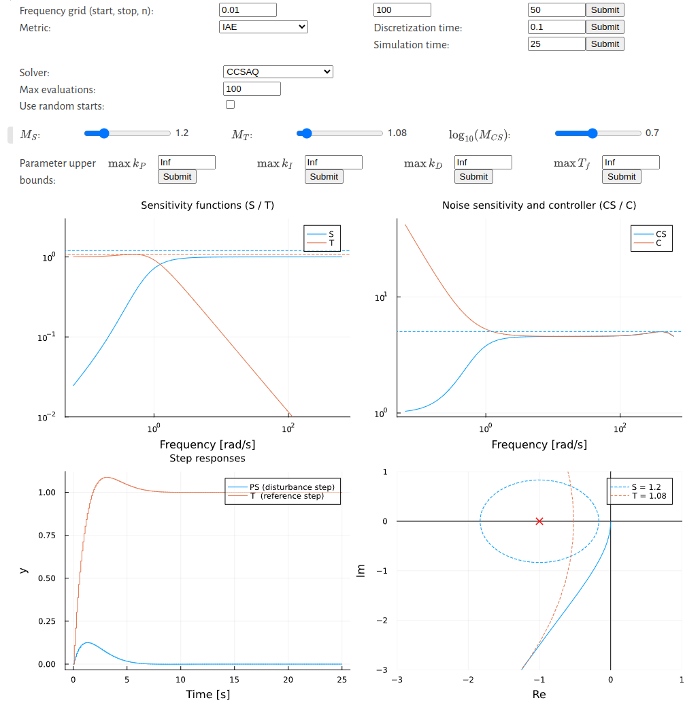
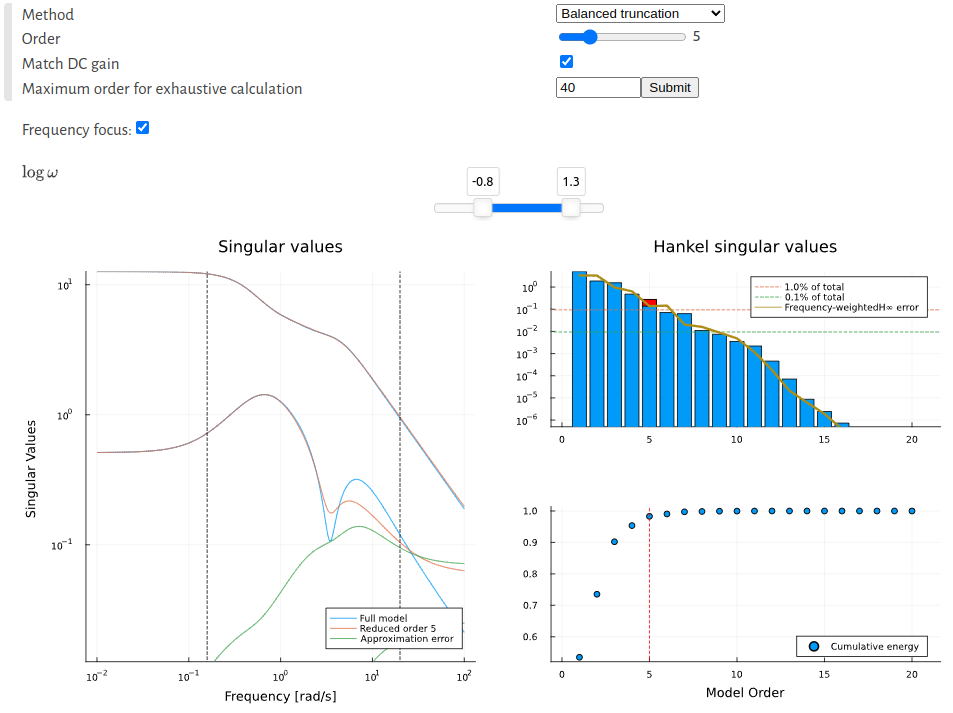

# GUI applications

The JuliaSim control library contains a number of apps with graphical user interfaces (GUI), listed here. Each app contains further documentation exposed from within the app.

## PID autotuning GUI
The PID autotuner allows you to tune PID controllers automatically by specifying robustness constraints. The app requires a SISO LTI system as input, and returns the parameters of the tuned PI/PID controller.
For more details around the autotuning procedure, see [PID Autotuning](@ref). 

The interactive area of the GUI is displayed below.
- The top three boxes allow the user to specify the frequency grid at which the frequency-domain constraints are evaluated. Changes to these parameters take affect first when the user presses the associated "Submit" button.
- The metric (`IE, IAE, IE followed by IAE`) can be selected using the dropdown menu labeled "metric".
- The dropdown menu to select a solver only appears if the `IAE` metric is chosen. The solver options are detailed  under [`solve`](@ref).
- The discretization time and simulation time control the duration and resolution of the time-domain simulation, shown in the bottom left plot.
- The sliders allow the user to control the upper limits (constraints) on the sensitivity function. These are the primary control knobs with which the user selects the desired tradeoff between performance and robustness.
- The boxes labeled "parameter upper bounds" allow the user to bound the PID parameters from above. Changes to these bounds take affect first when the user presses the associated "Submit" button.



When any of the interactive controls are changed, the autotuning problem is solved and the result is shown in the figures automatically.

Further documentation is available in the bottom of the graphical user interface.


### Example:
The app is launched using the function [`DyadControlSystems.app_autotuning`](@ref).
```julia
using DyadControlSystems
P = DemoSystems.sotd()
app_workspace = DyadControlSystems.app_autotuning(P)
res = app_workspace.res   # Obtain the result of the autotuning problem
prob = app_workspace.prob # Obtain the autotuning problem structure
```

```@docs
DyadControlSystems.app_autotuning
```

## Model reduction GUI
Model reduction of LTI systems by means of balanced truncation is exposed through the model-reduction app. More details on the model-reduction methods are available under [Model reduction](@ref).

The interactive area of the GUI is displayed below.
- The dropdown menu labeled "Method" allows the user to select between model reduction using balanced truncation or coprime-factor reduction.
- "Match DC-gain" allows the user to force the DC gain of the reduced-order model to match that of the full-order model exactly.
- If the model is of a lower order than the maximum order for exhaustive calculation, reduced-order models of all possible model orders are computed and visualized in the plot of Hankel singular values. If the model is of a larger order, upper bounds are used instead.
- If "frequency focus" is selected, a two-point slider is shown that allows the user to select a particular frequency range within which to prioritize the fit of the reduced-order model. The slider controls the logarithm of the upper and lower bounds of the prioritized frequency interval.




### Example:
The app is launched using the function [`DyadControlSystems.app_modelreduction`](@ref).
```julia
using DyadControlSystems
P = ssrand(1,1,20, proper=true)  # Create a random 2×2 system with 20 states
app_workspace = DyadControlSystems.app_modelreduction(P)
Pr = app_workspace.Pr # Obtain reduced system
```

```@docs
DyadControlSystems.app_modelreduction
```