# Control Library


The JuliaSim control library implements functionality for the design, simulation and optimization of control systems.

DyadControlSystems builds upon [ModelingToolkit.jl](https://github.com/SciML/ModelingToolkit.jl) and the [JuliaControl](https://github.com/JuliaControl/) ecosystem, providing a wide array of modeling, simulation, analysis and design methods for every step in the design and implementation of control systems. 

## Why DyadControlSystems?

JuliaSim handles the entire modeling, simulation and control workflow from component-based modeling from first principles, parameter estimation using data, and simulation, to the analysis, design and implementation of control systems. 

- JuliaSim is a *comprehensive* suite of tools for modeling and simulation. The underlying SciML ecosystem provides an unparalleled set of tools ranging from state-of-the-art workhorses like ODE solvers to cutting-edge methods like Neural PDEs.
- ModelingToolkit is the first *acausal modeling language embedded in a high-performance, high-level language*. This allows you to build component-based models that are both easy to understand, modify and maintain, and integrate naturally with surrounding, non-modeling code.
- JuliaSim and all of the surrounding tools are entirely *implemented in Julia*. Julia is a modern, high-performance, open-source programming language that is easy to learn and use. Julia allows you to quickly prototype and test your ideas, and then deploy them in production without translating the code to a lower-level language, making it a great choice for the entire modeling and control workflow.
- JuliaSim Control offers *a wide selection of tools for analysis and synthesis of control systems*, ranging from classical PID control, through ``\mathcal{H}_\infty`` and ``\mathcal{H}_2`` synthesis, to advanced Model-Predictive Control using detailed ModelingToolkit models or Neural Surrogates.
- JuliaSim Control is the first and only control-systems library that offers a *fully differentiable* environment for control design. This allows you to use gradient-based optimization methods to tune your controllers, perform gradient-based co design, and to use control systems as part of larger, differentiable machine-learning workflows.


## Modeling and simulation

JuliaSim builds upon [ModelingToolkit.jl](https://github.com/SciML/ModelingToolkit.jl), a symbolic, acausal modeling framework. ModelingToolkit.jl allows you to model component-based physical systems, making it easy to build detailed plant models out of reusable components. Learn more about ModelingToolkit in [the documentation](https://mtk.sciml.ai/dev/) or in the tutorial [Modeling for control using ModelingToolkit](@ref).

Under the surface, ModelingToolkit uses [DifferentialEquations.jl](https://diffeq.sciml.ai/stable/) to solve ODEs and DAEs. This interface can be used directly, learn more about this in [the documentation](https://diffeq.sciml.ai/stable/).

## Analysis and design of linear control systems
[JuliaControl](https://github.com/JuliaControl/) contains a wide range of tools for analysis and design of linear systems, learn more about this ecosystem [here](https://juliacontrol.github.io/ControlSystems.jl/stable/#Ecosystem).

To learn how to work with linear system types, such as linear statespace systems and transfer functions, as well as basic control analysis and design, consult the [ControlSystems.jl documentation](https://juliacontrol.github.io/ControlSystems.jl/). To learn about robust and optimal linear control, consult the [documentation of RobustAndOptimalControl.jl](https://juliacontrol.github.io/RobustAndOptimalControl.jl/stable/). Both aforementioned documentations contains examples and tutorial on the respective topics. JuliaSim extends the functionality of the JuliaControl ecosystem in several ways, exposed in this documentation.

## Getting started with DyadControlSystems

DyadControlSystems can be used directly in the [JuliaSim IDE](https://help.juliahub.com/juliasim/stable/gettingstarted/juliasimcloudide/) at [juliahub.com](https://juliahub.com/), but can also be installed locally using [these instructions](https://help.juliahub.com/juliasim/stable/gettingstarted/juliahubregistry/).

The following sections contain high-level overviews of how to approach the different tools available in DyadControlSystems. While these sections are intended for novice users, they may be useful also to the advanced user looking for an introduction to the tools offered in DyadControlSystems.

**Contents:**
```@contents
Pages = ["index.md"]
Depth = 2
```

**Tutorials** and reference documentation can be found in the sidebar on the left (hamburger menu on mobile).

## Control architecture cheat sheet

```@setup INDEX
#using Kroki

# link = "<a href='https://help.juliahub.com/DyadControlSystems/dev/tuning_objectives/' target='#95;blank' rel='noopener noreferrer'>Tutorial</a>"
#link = "<a href='https://help.juliahub.com/DyadControlSystems/dev/tuning_objectives/' target='_blank' rel='noopener noreferrer'>Tutorial</a>"
# link = "<a href='https://help.juliahub.com/DyadControlSystems/dev/tuning_objectives/'>Tutorial</a>"

# diagram1 = mermaid"""
# flowchart TD
#     DONE[ Done ]
#     A{{What would you like to do?}}
#     A -- "Make something move" --> PERF{{ Do you have high\nperformance requirements? }}
#     A -- "Keep something steady" --> REG["Tune a feedback controller for disturbance rejection\n$link"]

#     subgraph Reference tracking
#         PERF --> |YES| TRAJ_GEN[ Use a trajectory generator\nand model-based feedforward]
#         TRAJ_GEN --> DIST{{ Will there be disturbances\nacting on the system? }}
#         DIST --> |YES| DISTREJECT[ Tune a feedback controller\nfor disturbance rejection. ]
#         DIST --> |NO| REFTRACK[ Tune a feedback controller\nfor reference tracking. ]
        
#         PERF --> |NO| REFTRACK
#     end
#     DISTREJECT --> DONE
#     REFTRACK --> DONE
    
#     subgraph Regulation
#         REG --> REFCHANGE{{ Will the reference ever change? }}
#         REFCHANGE --> |YES| REFRESP{{Is the reference response\nof the controller inadequate?}}
#         REFRESP --> |YES| PREFILT[ Design a reference filter,\n use a trajectory generator or feedforward. ]
#     end

#     REFCHANGE --> |NO| DONE
#     REFRESP --> |NO| DONE
#     PREFILT --> DONE
# """

# mermaid_diagram_as_png_1 = render(diagram1, "png")
#write("mermaid_diagram.png", mermaid_diagram_as_png)

# mermaid_diagram_as_svg_1 = render(diagram1, "svg")
# write("mermaid_diagram1.svg", mermaid_diagram_as_svg_1)

# diagram2 = mermaid"""
# flowchart TD
#     LIN{{ Is your system linear\nor are you solving a regulation problem\nand can linearize a nonlinear model? }} --> |YES| SISO[ Do you have a SISO system? ]
#     LIN --> |NO| NONLIN[ Use MPC or proceed\nfurther down with gain scheduling. ] --> |Gain scheduling| SISO
#     SISO{{Do you have a SISO system?}} --> |YES| PID[ Consider using a\nPID controller] --> |Not good enough| DIST
#     SISO --> |NO| SIMO{{Do you have a SIMO system?}}
#     SIMO --> |YES| CPID[ Consider using a\nCascaded PID controller] --> |Not good enough| DIST
#     SIMO --> |NO| WEAKMIMO{{Is the system square and\nhas weakly interacting loops?}}
#     WEAKMIMO --> |YES| DECOUPLED[ Consider independent\nPID controllers\npossibly with a decoupler ] --> |Not good enough| DIST
#     WEAKMIMO --> |NO| DIST
#     DIST{{ Do you have modeled disturbances? }}
#     DIST --> |YES| DISTREJECT[ Include a disturbance model\nin the controller] --> CONST
#     DIST --> |NO| CONST{{ Do you have tight constraints on\ninputs, states or outputs? }}
#     CONST --> |YES| MPC[ Use an MPC controller ]
#     CONST --> |NO| REFTRACK{{ Are you solving a\nreference-tracking problem? }}
#     REFTRACK --> |YES| REFGEN[ Use a trajectory-generator ]
#     REFTRACK --> |NO| LQG[ Consider using an LQG, H2 or H-inf controller ]

#     REFGEN --> |Alternative 1| MPC
#     REFGEN --> |Alternative 2| FF[Use model-based feedforward] --> LQG
# """

# mermaid_diagram_as_png_2 = render(diagram2, "png")
# mermaid_diagram_as_svg_2 = render(diagram2, "svg")
# write("mermaid_diagram2.svg", mermaid_diagram_as_svg_2)
```


When faced with a control problem for the first time, the number of options available can be overwhelming. This decision tree can help novice users find the right tool for the job, and advanced users find appropriate tutorials on how to use the tools implemented in DyadControlSystems.

The first question to ask yourself is often whether you are solving a *regulation* problem or a *reference-tracking* problem, i.e., are you trying to keep the output of your system steady, or are you trying to make it move in a desired way?

```@setup INDEX
#HTML("""<object type="image/svg+xml" data=$(joinpath(Main.buildpath, "mermaid_diagram1.svg"))></object>""") # hide
# diagram1 # hide
```



### Regulation
When solving regulation problems, we are often primarily concerned with the ability of the controller to *reject disturbances*. A prime example is that of a temperature-controlled room, where the primary concern is to keep the temperature steady, and disturbances affecting the temperature such as people entering and leaving the room, or the sun shining through the window, are to be rejected. In this case, the reference is often constant, and the reference response of the controller is less of a concern.

In situations like this, the first step is usually to **tune a feedback controller for disturbance rejection**. If the system has a single input and a single output (SISO), a PID controller is a common choice. See the documentation on [PID Autotuning](@ref) for a user-friendly interface to automatic tuning of PID controllers. If you instead have a ModelingToolkit model with a predetermined structure of the control system, see the tutorial on [Automatic tuning of structured controllers](@ref).

If references may change every now and then and the controller has a poor response to reference changes, consider making use of a controller structure with two degrees of freedom. The simplest alternative in this case is to let, e.g., the P and D parts of a PID controller act on the measurement only, and let the integral part be the only part that acts on the reference. This approach is supported by the [`LimPID`](https://docs.sciml.ai/ModelingToolkitStandardLibrary/stable/API/blocks/#ModelingToolkitStandardLibrary.Blocks.LimPID) block in ModelingToolkitStandardLibrary through the parameters `wp, wd`, as well as by [DiscretePIDs.jl](https://github.com/JuliaControl/DiscretePIDs.jl). A more sophisticated approach that affords more options to shape the reference response is to make use of a reference prefilter or a trajectory generator. See the tutorials [Modeling for control using ModelingToolkit](@ref), [Control design for a pendulum on a cart](https://juliacontrol.github.io/RobustAndOptimalControl.jl/dev/cartpole/) and [MPC for autonomous lane changes](@ref) for examples of how to use these tools, as well as the package [TrajectoryLimiters.jl](https://github.com/baggepinnen/TrajectoryLimiters.jl).

For more complex regulation problems, such as when controlling systems with multiple inputs and multiple outputs (MIMO), DyadControlSystems offers a wide range of synthesis and analysis methods, including
- [Model-Predictive Control (MPC)](@ref)
- [LQR/LQG control](https://juliacontrol.github.io/RobustAndOptimalControl.jl/dev/lqg_disturbance/)
- [$\mathcal{H}_2$ control design](https://juliacontrol.github.io/RobustAndOptimalControl.jl/dev/measurable_disturbance/)
- [$\mathcal{H}_\infty$ control design](https://help.juliahub.com/DyadControlSystems/dev/examples/hinf_design/)

Of these alternatives, MPC is particularity advantageous when the problem is *constrained*, e.g., by limits on the control inputs, states our outputs.


### Reference tracking
When solving reference-tracking problems, we are often primarily concerned with the ability of the controller to *track a reference*. A prime example is that of a robot arm, where the goal is to make the end-effector move in a desired way, i.e., to make it follow a reference trajectory.

The first question to ask when designing a controller for a reference-tracking applications is whether or not the performance requirements are high. If the requirements are modest, we may be fine tuning a simple feedback controller to optimize the reference-tracking performance and call it a day. To this end, we may use the optimization-based automatic tuning described in [Automatic tuning of structured controllers](@ref). If, on the other hand, the performance requirements are tough, the best approach is often to make use of a trajectory generator and model-based feedforward, or Model-Predictive Control (MPC). A trajectory generator is responsible for generating a *dynamically feasible* reference trajectory, i.e., a trajectory that is physically realizable by the system. For systems where we are controlling positions and velocities, this requires that the reference trajectory has a bounded acceleration, i.e., the position reference has to be at least a $C^1$ function that is once continuously differentiable. The model-based feedforward makes use of an *inverse model* that maps the reference trajectory to a feedforward signal that is added to the feedback-control signal. In the absence of model errors, this feedforward signal will make the system follow the reference trajectory perfectly. In the presence of model errors (which are always present), the feedback signal is responsible for correcting the control error due to model mismatch and external disturbances. See the tutorials [Feedforward using an inverse model](@ref), [MPC for autonomous lane changes](@ref) and [Iterative-Learning Control](https://juliacontrol.github.io/ControlSystems.jl/dev/examples/ilc/) for examples using these methods.


### Choosing a controller type
Once we have chosen a controller architecture, we choose a controller type. A surprising number of control problems can be solved with PID controller in one way or another, but there are many other alternatives available that may be better suited for a particular problem. The choice of controller type is often dictated by external factors, and when it is not, it is often a matter of taste. [Any given control problem can be solved in many different ways](https://help.juliahub.com/DyadControlSystems/dev/examples/quadtank/), and this diagram is thus not to be taken as a strict guide, but rather as a preliminary starting point for the design process.
```@setup INDEX
#HTML("""<object type="image/svg+xml" width="60%" data=$(joinpath(Main.buildpath, "mermaid_diagram2.svg"))></object>""") # hide
#diagram2 # hide
```


There are two strong dichotomies among control problems that dictate the choice of controller, linear vs. nonlinear and SISO vs. MIMO.

Linear SISO problems are often adequately solved using PID controllers, and reference tracking can in these situations be handled by a trajectory generator ([example](https://help.juliahub.com/DyadControlSystems/dev/examples/self_driving_car/)) and model-based feedforward ([example](https://help.juliahub.com/DyadControlSystems/dev/examples/mtk_control/#Feedforward-using-an-inverse-model)). A model-based feedforward is not limited to linear models, use of a non-linear inverse model together with linear feedback is common in, e.g., robotics. Linear MIMO problems can, if the system is square and the interactions between loops not too strong, be solved using independent PID controllers ([example](https://help.juliahub.com/DyadControlSystems/dev/examples/quadtank/#PID-control)). Strongly interacting systems are often better approached using MIMO controller types such as LQG controllers and ``\mathcal{H}_\infty`` controllers ([example](https://juliacontrol.github.io/RobustAndOptimalControl.jl/dev/cartpole/)). 

Nonlinear SISO problems are often solved using gain scheduling, i.e., by designing several different linear controllers and switching or interpolating between them depending on the current operating point. Nonlinear MIMO problems and problems with tight constraints are often solved using MPC.

If significant disturbances affect the system, effort can be put in to model the disturbances. Several controller types allow easy incorporation of such disturbance models for improved disturbance rejection. See the tutorials [Disturbance modeling and rejection with MPC controllers](@ref), [MPC with model estimated from data](@ref), [Disturbance modeling in ModelingToolkit](@ref) for examples.

Control problems with a clear *economic objective*, such as minimizing the energy consumption of a system, are often solved using optimal-control methods such as MPC ([example](https://help.juliahub.com/DyadControlSystems/dev/examples/cstr_mpc/)).


## Obtaining a model for control
While simple controllers such as PID controllers can be tuned by experimentation on the controlled system, many more sophisticated control synthesis methods require a model of the system to be controlled. The model also may also be used for robustness analysis, as well as for model-based feedforward. A model may be obtained in multiple different ways, some of which are outlined here.

### Modeling from first principles
A first-principles model is derived from the laws of physics governing the system. Such a model can vary in complexity depending on how detailed laws of physics we include, and what phenomena we include in our model. While simple models can be encoded by manually defining the dynamics of the system on the form ``\dot x = f(x, u, p, t)``, more complex models may be more conveniently defined using a symbolic modeling language such as [ModelingToolkit.jl](https://docs.sciml.ai/ModelingToolkit/dev/). See the tutorial [Modeling for control using ModelingToolkit](@ref) for an introduction to this approach.


#### Fitting first-principles models to data
Models typically include several parameters that are not known a priori. These parameters may be estimated by fitting the model to experimental data obtained from the system. [JuliaSim ModelOptimizer](https://help.juliahub.com/jsmo/dev/) is a suite of tools to help you estimate parameters in this situation.

### Modeling directly from data
Modeling from first principles may sometimes be too time consuming and expensive, and sometimes the physics governing the system is unknown. In such situations, performing experiments on the system and building a black-box model from data may be more effective, a process commonly referred to as *system identification*. The simplest input-output models of dynamical systems are linear time-invariant models (LTI), these models can be obtained using any of the methods from [ControlSystemIdentification.jl](https://baggepinnen.github.io/ControlSystemIdentification.jl/stable/). Linear models often work surprisingly well, in particular for regulation problems where the task of the controller is to keep the output of the system fixed at a reference point. If a linear model is found to be inadequate, we may attempt to fit a nonlinear model, e.g., using [DataDrivenDiffEq.jl](https://docs.sciml.ai/DataDrivenDiffEq/stable/).

### Obtaining a linear model from a nonlinear model
Several synthesis and analysis methods in the field of control theory require a linear model. A nonlinear model may be *linearized* around an operating point in order to obtain a simplified, linear model. The page [Linear analysis](@ref) describes several methods for linearization.


## Robustness analysis
When tuning controllers using a model of the system, we should always perform a robustness analysis to ensure that the controller is robust to model mismatch and variation over time etc. This is particularity important when using some form of optimization-based control, since pushing the boundaries of performance requires a model with increasingly high fidelity.


For SISO systems (single input, single output), classical robustness measures include the [gain margin](https://en.wikipedia.org/wiki/Gain_margin) and the [phase margin](https://en.wikipedia.org/wiki/Phase_margin). These can be computed using the functions [`margin`](@ref) and [`marginplot`](@ref). The gain margin tells us how much the gain of the system can vary before our closed-loop system goes unstable. There are several reasons for why a closed-loop system must be robust w.r.t. gain variations
- The model of the system is inaccurate, e.g., due to modeling errors, linearization or other simplifications.
- The gain may vary with time, e.g., due to changes in the load on the system or changes in temperature.

The phase margin similarly tells us how much the phase of the system can vary before our closed-loop system goes unstable. It is common to aim for a phase margin of 30-60 degrees. A large phase margin also guard us against unexpected delays in the system, such as delays in reading from the sensor, or communicating a change to an actuator.

Slightly more sophisticated robustness measures include computing the peak gains of the sensitivity function and the complementary sensitivity function, which can be computed using the functions [`sensitivity`](@ref), [`comp_sensitivity`](@ref) as well as using the functions [`gangoffour`](@ref) and [`gangoffourplot`](@ref). These concepts are all outlined in the video tutorial on basic usage of robustness analysis with JuliaControl, referenced below.
```@raw html
<iframe style="height: 315px; width: 560px" src="https://www.youtube.com/embed/zTW4mlWNumo" title="YouTube video player" frameborder="0" allow="accelerometer; autoplay; clipboard-write; encrypted-media; gyroscope; picture-in-picture" allowfullscreen></iframe>
```
Additional tutorials performing robustness analysis for are [DC Motor with PI-controller](https://docs.sciml.ai/ModelingToolkitStandardLibrary/stable/tutorials/dc_motor_pi/) and [Robust MPC tuning using the Glover McFarlane method](@ref).

For MIMO systems (multiple inputs, multiple outputs), gain and phase margins are considerably less useful measures of robustness, while the peak gain of the sensitivity functions remain useful. Other, more advanced measures of robustness applicable also to MIMO systems are [`diskmargin`](@ref)[^diskmargin] (also mentioned in the video above), and [`ncfmargin`](@ref).

[^diskmargin]: [Seiler, Peter, Andrew Packard, and Pascal Gahinet. "An introduction to disk margins."](https://arxiv.org/pdf/2003.04771.pdf)

## Comparison of synthesis methods

The following table indicates which control synthesis methods are applicable in different scenarios. A green circle (🟢) indicates that a particular synthesis method is well suited for the situation, an orange diamond (🔶) indicates that a match is possible, but somehow not ideal, while a red square (🟥) indicates that a method in its standard form is ill suited for the situation. The table is not exhaustive, and is intended to give a rough overview of the applicability of different synthesis methods. For more information, see the tutorials on the individual synthesis methods. Several methods can be adopted to handle the situations for which they are indicated as poor choices, such as using several independent PID-controllers to control square MIMO systems with weak coupling etc.

```@setup SYNTHESIS
using PrettyTables, Markdown

header = ["Synthesis method", "SISO", "SIMO", "MISO", "MIMO", "Disturbance models", "Uncertainty models", "Time-varying system", "Nonlinear system", "Constraints"]

data = [
    "PID"                 "🟢" "🟥" "🟥" "🟥" "🟥" "🟥" "🟥" "🟥" "🟥"
    "Cascade PID"         "🟢" "🟢" "🟥" "🟥" "🟥" "🟥" "🟥" "🟥" "🟥"
    "Mid-ranging control" "🟢" "🟥" "🟢" "🟥" "🟥" "🟥" "🟥" "🟥" "🟥"
    "Gain-scheduled PID"  "🟢" "🟥" "🟥" "🟥" "🟥" "🟥" "🟥" "🟢" "🟥"
    "LQG"                 "🟢" "🟢" "🟢" "🟢" "🟢" "🟥" "🟥" "🟥" "🟥"
    "H∞"                  "🟢" "🟢" "🟢" "🟢" "🟢" "🔶" "🟥" "🟥" "🟥"
    "Glover-McFarlane"    "🟢" "🟢" "🟢" "🟢" "🟢" "🔶" "🟥" "🟥" "🟥"
    "MPC"                 "🟢" "🟢" "🟢" "🟢" "🟢" "🟢" "🟢" "🟢" "🟢"
]

io = IOBuffer()
tab = pretty_table(io, data; header, tf=tf_html_default)
tab_synthesis = String(take!(io)) |> HTML
```
```@example SYNTHESIS
tab_synthesis # hide
```

- An example of Cascaded PID controllers is provided under [Automatic tuning of structured controllers](@ref).
- [Mid-ranging control](https://lup.lub.lu.se/search/publication/7fbf7cdf-8b1b-450e-b40d-299bf908bea2) refers to a control strategy where one controller handles large input variations but slowly, while a second controller handles small input variations quickly. The slow controller is in this setup designed to keep the fast controller in the middle of its operating range to avoid saturation, hence the name *midranging*.
- [Gain scheduling](https://en.wikipedia.org/wiki/Gain_scheduling) refers to the variation of controller gains depending on some measurable quantity. As an example, parameters of a PID controller for an electrical motor may be varied depending on the moment of inertia of the motor load. This is a common and simple method of realizing a nonlinear controller. Gain scheduling is not limited to PID control, and may also be used for other linear control architectures, such as LQR or ``\mathcal{H}_\infty`` controllers. A tutorial using gain scheduling is available here: [Batch Linearization and gain scheduling](https://juliacontrol.github.io/ControlSystemsMTK.jl/dev/batch_linearization/).
- LQG-control refers to state-feedback control from states estimated with a Kalman filter, several tutorials are available on this topic, e.g., [Disturbance modeling and rejection with LQG controllers](https://juliacontrol.github.io/RobustAndOptimalControl.jl/dev/lqg_disturbance/).
- ``\mathcal{H}_\infty``-control refers to the design of controllers that minimize a worst-case objective over frequencies of the closed-loop system. ``\mathcal{H}_\infty``-synthesis is often used as a component in robust control design. See the tutorials [``\mathcal{H}_\infty`` control design](https://help.juliahub.com/DyadControlSystems/dev/examples/hinf_design/) and [Mixed-sensitivity  ``\mathcal{H}_\infty`` control design](https://juliacontrol.github.io/RobustAndOptimalControl.jl/dev/hinf_DC/) for examples.
- The method of Glover-McFarlane is a robust-control design method that is based on ``\mathcal{H}_\infty``-synthesis. This method prompts the user to perform an initial (possibly MIMO) loop-shaping design, followed by an automatic robustification procedure. See the documentation for [`glover_mcfarlane`](@ref) and the tutorials [Control design for a pendulum on a cart](https://juliacontrol.github.io/RobustAndOptimalControl.jl/dev/cartpole/#Robustification-using-Glover-McFarlane) and [Robust MPC tuning using the Glover McFarlane method](@ref) for examples.
- Model-predictive control (MPC) is a modern feedback-control strategy that is based on repeated optimization of a cost function over a finite time horizon. MPC natively handles nonlinear, time-varying MIMO systems with constraints, and is thus a very powerful tool for control design. This power comes at a cost of increased computational complexity compared to more traditional control strategies. See [Model-Predictive Control (MPC)](@ref) for the documentation of the MPC functionality in DyadControlSystems, as well as the numerous tutorials available.


## Comparison of analysis methods

The following table indicates which closed-loop analysis methods are applicable in different scenarios. A green circle (🟢) indicates that a particular analysis method is well suited for the situation, an orange diamond (🔶) indicates that a method can be used to gain some insight, but it's use is somehow not ideal, while a red square (🟥) indicates that a method in its standard form is ill suited for the analysis task.
```@setup ANALYSIS
using PrettyTables, Markdown

header = ["Analysis method", "SISO", "MIMO", "Modeled uncertainties", "Time-varying system", "Nonlinear system", "Constraints"]

data = [
    "Gain margin"                           "🟢" "🟥" "🟥" "🟥" "🟥" "🟥"
    "Phase margin"                          "🟢" "🟥" "🟥" "🟥" "🟥" "🟥"
    "Peak gain of sensitivity functions"    "🟢" "🟢" "🔶" "🟥" "🟥" "🟥"
    "Diskmargin"                            "🟢" "🟢" "🔶" "🟥" "🟥" "🟥"
    "NCF margin"                            "🟢" "🟢" "🔶" "🟥" "🟥" "🟥"
    "Structured singular value"             "🟢" "🟢" "🟢" "🔶" "🔶" "🟥"
    "Lyapunov-function search"              "🟢" "🟢" "🟥" "🟢" "🟢" "🟢"
]

io = IOBuffer()
tab = pretty_table(io, data; header, tf=tf_html_default)
tab_analysis = String(take!(io)) |> HTML
```
```@example ANALYSIS
tab_analysis # hide
```

Of these methods, the first 5 are well established and easy to use, while the structured singular value and Lyapunov-function search are more advanced methods that require some knowledge of the underlying theory. The following list provides links to the documentation of the methods that are easily accessible from within DyadControlSystems:

- Gain margin: [`margin`](@ref), [`marginplot`](@ref)
- Phase margin: [`margin`](@ref), [`marginplot`](@ref)
- Peak gain of sensitivity functions: [`gangoffour`](@ref), [`sensitivity`](@ref), [`hinfnorm2`](@ref)
- Diskmargin: [`diskmargin`](@ref)
- NCF margin: [`ncfmargin`](@ref)
- Structured singular value: [`mussv`](@ref)

