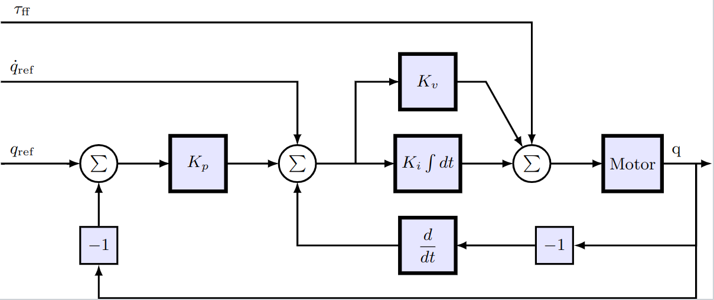

# Tuning objectives
When designing a control system, it is common to work towards satisfying a number requirements. In DyadControlSystems, such requirements can be encoded in `TuningObjective`s, an abstract type that affords both visualization and optimization controllers to meet tuning requirements. The objectives can thus be used for two primary tasks
- Visualization of requirements
- Optimization-based autotuning
which we cover in the following sections:
```@contents
Pages = ["tuning_objectives.md"]
```

The first section below indicates how to construct tuning objectives and visualize them in a plot, while the subsequent section demonstrates their usage for automatic controller tuning in a ModelingToolkit model. This tutorial is available also in video form:
```@raw html
<iframe style="height: 315px; width: 560px" src="https://www.youtube.com/embed/HHOeAT4RV_4" title="YouTube video player" frameborder="0" allow="accelerometer; autoplay; clipboard-write; encrypted-media; gyroscope; picture-in-picture" allowfullscreen></iframe>
```

## Visualize performance and robustness requirements
We illustrate how performance and robustness specifications can be visualized by creating instances of *objective types* for which plot recipes are available.


[`MaximumSensitivityObjective`](@ref):
```@example objectives
using DyadControlSystems, Plots
gr(fmt=:png) # hide
G = tf(2, [1, 0.3, 2])           # An example system
w = exp10.(LinRange(-2, 2, 200)) # A frequency vector

W = tf([2, 0], [1, 1]) # A weight specifying the maximum allowed sensitivity
S = feedback(1, G)     # The sensitivity function
bodeplot(S, w, plotphase=false)
plot!(MaximumSensitivityObjective(W), w, title="MaximumSensitivityObjective")
```

---

[`OvershootObjective`](@ref):
```@example objectives
plot(step(G, 15))
plot!(OvershootObjective(1.2), title="OvershootObjective")
```

---

[`RiseTimeObjective`](@ref):
```@example objectives
plot(step(G, 15))
plot!(RiseTimeObjective(0.6, 1), title="RiseTimeObjective")
```

---

[`SettlingTimeObjective`](@ref):
```@example objectives
plot(step(G, 15))
plot!(SettlingTimeObjective(1, 5, 0.2), title="SettlingTimeObjective")
```

---

[`StepTrackingObjective`](@ref):
```@example objectives
plot(step(G, 15))
o = StepTrackingObjective(tf(1, [1,2,1])) # Takes a reference model
plot!(o, title="StepTrackingObjective")
```

[`StepTrackingObjective`](@ref) for step rejection:
```@example objectives
plot(step(G*feedback(1, G), 15))
o = StepTrackingObjective(tf([1, 0], [1,2,1])) # Takes a reference model
plot!(o, title="Step rejection using StepTrackingObjective")
```

---

[`GainMarginObjective`](@ref) and [`PhaseMarginObjective`](@ref):
```@example objectives
dm = diskmargin(G, 0, w)
plot(dm)
plot!(GainMarginObjective(2),   title="GainMarginObjective")
plot!(PhaseMarginObjective(45), title="PhaseMarginObjective")
```

## Automatic tuning of structured controllers
In this section, we will explore how we can make use of the tuning objectives illustrated above for automatic tuning of structured controllers. Each tuning objective can upon creation take one or several signals that relate to a model in which we want to tune the control performance. This functionality is built around the concept of an [*analysis point*](http://mtkstdlib.sciml.ai/dev/API/linear_analysis/), which for the purposes of autotuning can be thought of as a *named signal* of interest in the model. Analysis points can be used to linearize the model and compute sensitivity functions automatically, something that is required for the autotuning functionality.

We demonstrate the usage by means of a simple example, where we first perform tuning of a PI speed controller for a DC motor, and then add an outer position-control loop to form a cascade control architecture, where both loops are automatically tuned.

### Example: PI controller tuning for a DC motor 

The system to control is a DC motor with a PI controller for the velocity. See the [DC-motor tutorial](http://mtkstdlib.sciml.ai/dev/tutorials/dc_motor_pi/) for how to build this system, insert analysis points and compute sensitivity functions. In the present tutorial, we will load the pre-built system from `DyadControlSystems.ControlDemoSystems.dcmotor()`. This system contains three analysis points, `r, u, y` for the reference, control signal and output of the velocity sensor.

The block diagram below shows a typical control architecture for a motion-control system, which is the final system we will work towards. In this section, we are currently concerned with tuning $K_v$ and $K_i$, the proportional and integral gains for a PI velocity controller. The outer loop closed through $K_p$ will be added in the next section.


```@setup STRUCTURED_TUNING
using DyadControlSystems, ModelingToolkitStandardLibrary.Blocks, Plots
function DyadControlSystems.Symbolics.Latexify._latexraw(ap::Blocks.AnalysisPoint; kwargs...)
    string(ap)
end
default(size=(800, 400), titlefontsize=10)
```

```@example STRUCTURED_TUNING
using DyadControlSystems, DyadControlSystems.MPC
using ModelingToolkit

sys = DyadControlSystems.ControlDemoSystems.dcmotor()
nothing # hide
```
We then **specify the parameters we want to tune** as a vector of pairs, from parameter to a tuple of bounds. In this case, we tune the proportional gain and the gain of the integrator in the controller. To be able to refer to the parameters correctly, we call `complete` on the model first. We also **specify one or several operating points** in which we want to tune the parameters. This system is linear, so a single operating point is sufficient. Had the system been nonlinear, or some parameters of the system were uncertain, we could specify several points here and the tuning would be done to meet requirements for all operating points. An operating point is here defined as a dictionary of `variable => value` pairs, where the variables include both states and parameters for the system. In this case, we use the defaults already defined in the system.
```@example STRUCTURED_TUNING
sysc = complete(sys)
tunable_parameters = [
    sysc.pi_controller.gainPI.k => (1e-9, 100.0) # parameter => (lower_bound, upper_bound)
    sysc.pi_controller.int.k    => (2.0, 1e2)
]

operating_points = [ # Can be one or several operating points
    Dict(sysc.L1.p.i => 0.0)
]
nothing # hide
```

!!! note "What is an operating point?"
    An operating point is typically understood as a tuple of the form ``(x, u)``, where ``x`` is the state vector and ``u`` is the input vector. However, we may choose to include *parameters* ``p`` in the operating point as well. This may be useful when some parameters are uncertain or time varying, and we want to perform analysis over multiple possible parameter values.

The next step is to **define our requirements by specifying tuning objectives**. We will include 4 objectives for the purpose of demonstration, but it is often sufficient to use a smaller number of objectives. Note, however, that it is often best to include at least one performance promoting objective and one robustness promoting objective.

The [`StepTrackingObjective`](@ref) allows us to specify a reference model (``G_{ref}``) that indicates how we want a step-response of the closed-loop system to behave. In this case, we consider the step response from analysis point `r` to `y`. We also include a constraint on the sensitivity function at the plant output `y`, with a weight ``W_S``. These two objectives are often a good start, but here we add also a [`OvershootObjective`](@ref) and a [`RiseTimeObjective`](@ref) to fine-tune the transient response and demonstrate their usage.

```@example STRUCTURED_TUNING
WS    = tf([1.5, 0], [1, 50])
ω     = 2pi*20.0
Gref  = tf(ω^2, [1, 2ω, ω^2])
sto   = StepTrackingObjective(reference_model=Gref, tolerance=0.05, input=sys.r, output=sys.y)
mso   = MaximumSensitivityObjective(WS, sys.y)
oo    = OvershootObjective(max_value = 1.05, input=sys.r, output=sys.y)
rto   = RiseTimeObjective(min_value = 0.91, time = 0.025, input=sys.r, output=sys.y)
seto  = SettlingTimeObjective(; final_value = 1.0, time = 0.025, tolerance = 0.09, input=sys.r, output=sys.y) # We do not use this objective here, but one sometimes trades the overshoot and rise-time objectives for this objective
objectives = [
    sto,
    mso,
    oo,
    rto,
    # seto,
]
```
The last step before defining the problem is to **specify time and frequency grids** at which to evaluate the objectives. Denser grids make the result more accurate, but increases the time to solution.
```@example STRUCTURED_TUNING
w = exp10.(LinRange(0, 3, 200))
t = 0:0.001:0.21
nothing # hide
```
We now define the problem:
```@example STRUCTURED_TUNING
prob = StructuredAutoTuningProblem(sys, w, t, objectives, operating_points, tunable_parameters)
```

To solve it, we specify an **initial guess** for the parameters, this is a vector in the same order as the `tunable_parameters`. The solver can be chosen freely among the solvers that are supported in [Optimization.jl](https://docs.sciml.ai/Optimization/stable/)
```@example STRUCTURED_TUNING
p0 = [1.0, 20] # Initial guess
res = solve(prob, p0,
    MPC.IpoptSolver(verbose=true, exact_hessian=false, acceptable_iter=4, tol=1e-3, acceptable_tol=1e-2, max_iter=100);
)
```
When the problem has been solved, we may **plot the results**
```@example STRUCTURED_TUNING
plot(res)
```
This shows one plot for each tuning objective. In this case, we approximately meet all the requirement, save for the rise-time requirement that shows a slight violation. In general, it may not be feasible to meet all requirements, and the result will be a trade-off between them all. The field `res.objective_status` contains diagnostics for each operating point, where each entry indicates the relative satisfaction of each tuning objective, smaller values are better.
```@example STRUCTURED_TUNING
res.objective_status[1] # Inspect the results in the first (and in this case only) operating point
```

#### Adding an outer position loop

In the example thus far, we have closed the velocity loop using  PI controller. As mentioned above, a common control architecture for position-controlled systems is to add an outer P controller that controls the position, forming a *cascade controller*. In this section, we will add such an outer position loop, $K_p$ in the block diagram, and tune both controllers automatically. This time, we create the DC-motor system using `dcmotor(ref=nothing)` to indicate that we want nothing connected to the reference of the inner PI controller, and we add new `connections` corresponding to the outer loop. The P controller for the position loop uses a `Blocks.Gain()` block. To get good performance, it's important to add a velocity feedforward connection directly to the velocity controller, $\dot{q}_{ref}$ in the block diagram, without this, the velocity loop would be error driven only, necessitating an error for the system to move (more comments on this in the next section).


```@example STRUCTURED_TUNING
sys_inner             = DyadControlSystems.ControlDemoSystems.dcmotor(ref=nothing)
@named ref            = Blocks.Step(height = 1, start_time = 0)
@named ref_diff       = Blocks.Derivative(T=0.1) # This will differentiate q_ref to q̇_ref
@named add            = Blocks.Add()      # The middle ∑ block in the diagram
@named p_controller   = Blocks.Gain(10.0) # Kₚ
@named outer_feedback = Blocks.Feedback() # The leftmost ∑ block in the diagram
@named id             = Blocks.Gain(1.0)  # a trivial identity element to allow us to place the analysis point :r in the right spot

connect = ModelingToolkit.connect
connections = [
    connect(ref.output, :r, id.input)                               # We now place analysis point :r here
    connect(id.output, outer_feedback.input1, ref_diff.input)
    connect(ref_diff.output, add.input1)
    connect(add.output, sys_inner.feedback.input1)
    connect(p_controller.output, :up, add.input2)                   # Analysis point :up
    connect(sys_inner.angle_sensor.phi, :yp, outer_feedback.input2) # Analysis point :yp
    connect(outer_feedback.output, :ep, p_controller.input)         # Analysis point :ep
]

@named closed_loop = ODESystem(connections, ModelingToolkit.get_iv(sys_inner); systems = [sys_inner, ref, id, ref_diff, add, p_controller, outer_feedback])
nothing # hide
```

We will use a [`MaximumSensitivityObjective`](@ref) for the inner loop, since this loop is primarily concerned with rejecting disturbances. When creating this objective, we specify `loop_openings=[:yp]` to indicate that we want to compute the sensitivity function at the velocity output with the position loop `:yp` opened (more info about this in the section below).
```@example STRUCTURED_TUNING
cl = complete(closed_loop)

tunable_parameters = [
    cl.dcmotor.pi_controller.gainPI.k => (1e-1, 10.0)
    cl.dcmotor.pi_controller.int.k    => (2.0, 1e2)
    cl.p_controller.k                 => (1e-2, 1e2)
]

operating_points = [ # Can be one or several operating points
    Dict(cl.dcmotor.L1.p.i => 0.0)
]

ωp    = 2pi*3.0                     # Desired position-loop bandwidth
Pref  = tf(ωp^2, [1, 2ωp, ωp^2])    # Desired position step response
stp   = StepTrackingObjective(reference_model = Pref, tolerance = 0.05, input=closed_loop.r, output=closed_loop.yp)
mso2  = MaximumSensitivityObjective(weight=WS, output=closed_loop.dcmotor.y, loop_openings=[closed_loop.yp])
objectives = [
    stp,
    mso2,
]

w = exp10.(LinRange(0, 3, 200))
t = 0:0.001:1
prob = DyadControlSystems.StructuredAutoTuningProblem(closed_loop, w, t, objectives, operating_points, tunable_parameters)

x0 = [1.0, 20, 0.1]
res = solve(prob, x0,
    MPC.IpoptSolver(verbose=true, exact_hessian=false, acceptable_iter=4, tol=1e-3, acceptable_tol=1e-2, max_iter=100);
)
```

```@example STRUCTURED_TUNING
plot(res)
```

We can simulate the nonlinear system with the optimized operating point
```@example STRUCTURED_TUNING
using OrdinaryDiffEq
ssys = structural_simplify(closed_loop)
optimal_op = res.op[1]
optimal_op[ssys.dcmotor.L1.n.i] = 0.0
simprob = ODEProblem(ssys, optimal_op, (0.0, 1.0))
sol = solve(simprob, Tsit5())
plot(sol, idxs=[ssys.dcmotor.inertia.phi, ssys.ref.output.u])
```

#### A note about the loop opening
Why did we open the position loop when we computed the sensitivity function at the velocity output? The position loop fundamentally changes the closed-loop behavior of the system, compare the sensitivity functions below, computed with and without the loop closed
```@example STRUCTURED_TUNING
op1 = res.op[1]
wsens = exp10.(LinRange(-2, 3, 200))
bodeplot([
    ss(get_sensitivity(closed_loop, closed_loop.dcmotor.y; op=op1)[1]...),
    ss(get_sensitivity(closed_loop, closed_loop.dcmotor.y; op=op1, loop_openings=[closed_loop.yp])[1]...)
    ], wsens, plotphase = false,
    lab    = ["Position loop closed" "Position loop open"],
    title  = "Sensitivity at velocity output", size=(500, 300),
    legend = :bottomright
)
```
The output sensitivity function is the transfer function from the reference to the control error, and without the position loop, the velocity controller is able to track low-frequency velocity references perfectly due to the integrator in the PI controller. When we add the outer position loop, we are no longer free to set the velocity to whatever we want, and it's instead the position controller that dictates the reference for the velocity controller, this manifests itself as an inability to follow independent velocity references for low frequencies. 

Had we not included the velocity feedforward from the reference to the velocity controller, we would instead have obtained the following result
```@example STRUCTURED_TUNING
op_no_vel_ff = deepcopy(res.op[1])
op_no_vel_ff[ref_diff.k] = 0 # Turn off velocity feedforward
prob2 = DyadControlSystems.StructuredAutoTuningProblem(closed_loop, w, t, objectives, [op_no_vel_ff], tunable_parameters)

res2 = solve(prob2, x0,
    MPC.IpoptSolver(verbose=true, exact_hessian=false, acceptable_iter=4, tol=1e-3, acceptable_tol=1e-2, max_iter=100);
)
plot(res2)
```
with the following sensitivity function
```@example STRUCTURED_TUNING
op_no_vel_ff = res2.op[1]
bodeplot([
    ss(get_sensitivity(closed_loop, closed_loop.dcmotor.y; op=op_no_vel_ff)[1]...),
    ss(get_sensitivity(closed_loop, closed_loop.dcmotor.y; op=op_no_vel_ff, loop_openings=[closed_loop.yp])[1]...)
    ], wsens, plotphase = false,
    lab    = ["Position loop closed" "Position loop open"],
    title  = "Sensitivity without velocity feedforward", size=(500, 300),
    legend = :bottomright
)
```
i.e., while the controller still appears to track the reference step quite well, the sensitivity function at the velocity output looks significantly worse, indicating that the closed-loop system will suffer quite poor disturbance-rejection properties, and likely be sensitive to model errors.

## Tuning with uncertain parameters

The autotuning framework supports modeling and solving autotuning problems with *parametric uncertainty*, something we will explore in this section. Uncertainty is the fundamental reason we are making use of feedback, and parametric uncertainty is a particularly intuitive form of uncertainty that is easy to reason about. When tuning a controller, we may want to model known parametric uncertainty and make sure the tuned closed-loop system is robust with respect to known parameter variations.

Below, we solve the same autotuning problem as in the example where we tuned the PI velocity controller above, but in this case we model a uniformly distributed uncertainty in the inertia of the rotating load. To tell the system that a particular parameter is uncertain, give it an uncertain value in the form of [`MonteCarloMeasurements.Particles`](https://baggepinnen.github.io/MonteCarloMeasurements.jl/stable/). Below, we construct a uniformly sampled uncertain value between 0.015 and 0.025 with `N = 5` samples like so: `Particles(N, Uniform(0.015, 0.025))`. We may choose any distribution of our choice, but if we have more than one uncertain parameter, they must all use the same number of samples `N`.

```@example STRUCTURED_TUNING
using MonteCarloMeasurements
N = 5 # Number of samples for the uncertain parameters
sys = DyadControlSystems.ControlDemoSystems.dcmotor()
sysc = complete(sys)
op = Dict()
op[sysc.inertia.J] = Particles(N, Uniform(0.015, 0.025))
op[sysc.L1.p.i] = 0.0
operating_points = [op]
```

Otherwise we proceed exactly like before:
```@example STRUCTURED_TUNING
tunable_parameters = [
    sysc.pi_controller.gainPI.k => (1e-9, 100.0)
    sysc.pi_controller.int.k    => (2.0, 1e2)
]

objectives = [
    sto,
    seto,
    mso,
]

w = exp10.(LinRange(0, 3, 200))
t = 0:0.001:0.21
prob = StructuredAutoTuningProblem(sys, w, t, objectives, operating_points, tunable_parameters)

x0 = [1.0, 20]
res = solve(prob, x0,
    MPC.IpoptSolver(verbose=true, exact_hessian=false, acceptable_iter=4, tol=1e-3, acceptable_tol=1e-2, max_iter=100);
)

plot(res)
```
This time, we see that the optimized controller is unable to satisfy all requirements for all instantiations of the uncertain system, maybe we're asking too much from a simple PID controller?[^1]

Underneath the hood, the uncertain operating point is expanded into `N = 5` operating points, and the optimizer tries to satisfy the tuning requirements for all of them. If we had used more than one operating point in the vector `operating_points`, we would get a total of `N*length(operating_points)` total operating points in the optimization problem.

[^1]: Indeed, we are. For one, we have not added the signal $\tau_{ff}$ appearing in the block diagram, indicating a torque feedforward signal that decouples the disturbance rejection and tracking properties of the control system. 
## Index

```@index
Pages = ["tuning_objectives.md"]
```
```@autodocs
Modules = [DyadControlSystems]
Pages = ["tuning_objectives.jl"]
Private = false
Order   = [:function, :type]
```
